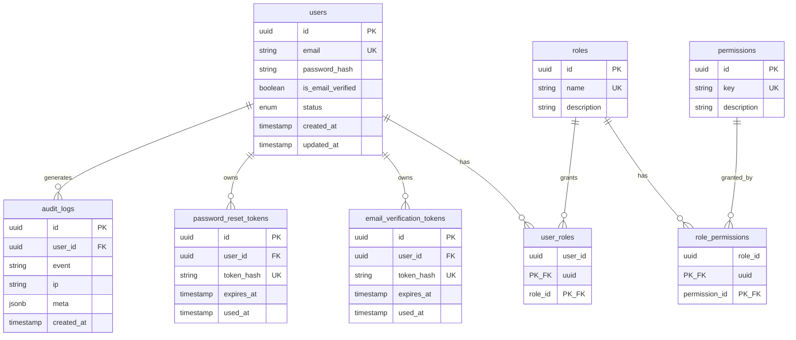

# Database Design — PostgreSQL

**Tooling choice:** `pg` (connection pool) + **Knex** (migrations / seeds)

| Option | Why we did / didn’t pick it |
|--------|-----------------------------|
| **Knex + pg** | Explicit SQL, migrations as code, easy `EXPLAIN`, full control of indexes/FKs — best for learning production patterns |
| Prisma | Great DX, but abstracts SQL/indexes more |
| Raw `pg` only | Possible, but you’d reinvent migration versioning |

---

## ER diagram



### Relationships

| Relation | Cardinality | Notes |
|----------|-------------|-------|
| users ↔ roles | N:M via `user_roles` | Default role `user` on register |
| roles ↔ permissions | N:M via `role_permissions` | Fine-grained RBAC |
| users → email/password tokens | 1:N | Store **hashes** only; single-use via `used_at` |

---

## Refresh tokens: Postgres vs Redis

**Decision (aligned with HLD):** active refresh sessions live in **Redis** (TTL, rotation, fast revoke).

| Store | What belongs there |
|-------|--------------------|
| **Redis** | Current refresh session keys, access `jti` denylist, rate-limit counters |
| **PostgreSQL** | Users, roles, email/password-reset token hashes, audit events |

We **do not** create a `refresh_tokens` table in the initial migration. Add one later only if you need durable session-history auditing in SQL.

---

## Constraints & indexes

- `users.email` — **UNIQUE** (DB-level duplicate prevention)
- `users(lower(email))` — index for case-normalized lookups
- Token tables — **UNIQUE(`token_hash`)**, indexes on `user_id`, `expires_at`
- All FKs with `ON DELETE CASCADE` (or `SET NULL` on audit `user_id`)

---

## Connection pooling

Configured in `src/db/index.js` via `pg.Pool`:

| Setting | Env | Default |
|---------|-----|---------|
| max clients | `DB_POOL_MAX` | 10 |
| idle timeout | `DB_POOL_IDLE_MS` | 30000 |
| connect timeout | `DB_POOL_CONN_TIMEOUT_MS` | 5000 |

**Rule:** never `new Client()` per HTTP request — always use `getPool()` / `query()` / `withTransaction()`.

---

## ACID transactions

Multi-step writes must be atomic. Example (registration — Issue #06):

```text
BEGIN
  INSERT user
  INSERT user_roles (default "user")
  INSERT email_verification_tokens (hash)
COMMIT
```

Use `withTransaction(async (client) => { ... })` from `src/db/index.js`.  
If any step fails → `ROLLBACK` → no half-created accounts.

---

## Query optimization mindset (`EXPLAIN`)

When a login or token lookup feels slow:

```sql
EXPLAIN ANALYZE
SELECT * FROM users WHERE lower(email) = lower('user@example.com');
```

Check for **Seq Scan** on large tables when you expected an **Index Scan**. Ensure filters match an index (`email`, `token_hash`, `user_id`).

---

## Migrations & seeds

```bash
# Requires Postgres reachable at DATABASE_URL
npm run migrate      # apply
npm run seed         # roles + permissions
npm run db:setup     # migrate + seed
npm run migrate:rollback
npm run migrate:status
```

Seed creates roles: `user`, `moderator`, `admin`, plus permission keys and mappings.

---

## Local Postgres (Docker)

```bash
docker run --name auth-pg \
  -e POSTGRES_PASSWORD=postgres \
  -e POSTGRES_DB=auth_service \
  -p 5432:5432 \
  -d postgres:16
```

Then `npm run db:setup`.
