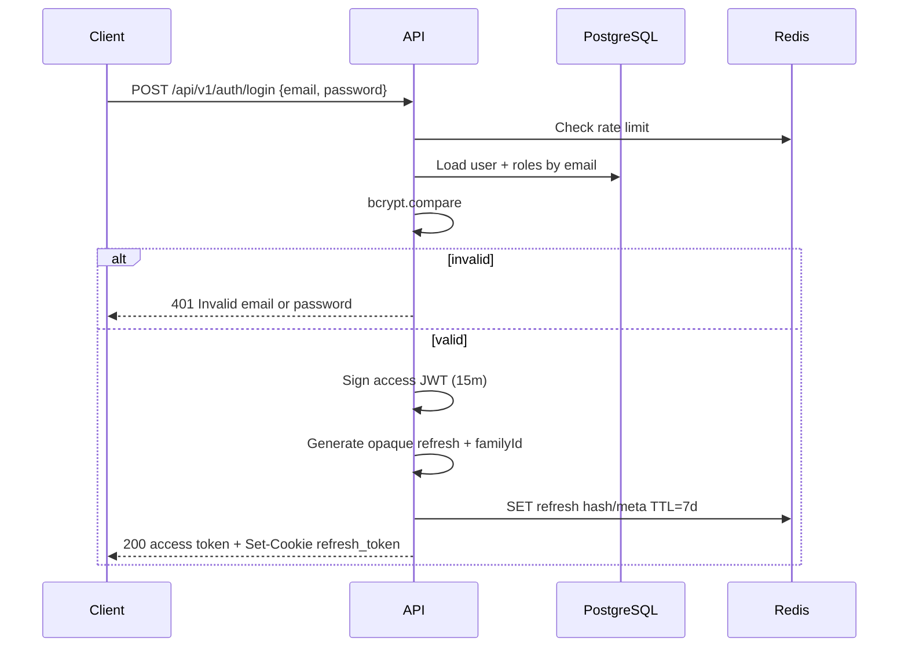
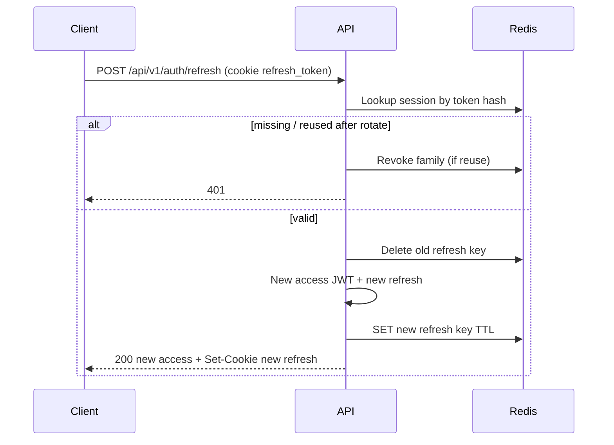
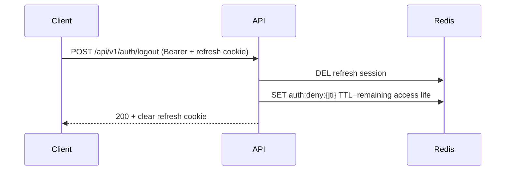

# High-Level Design — Authentication Service

**Project:** Backend Roadmap Project #3 — Authentication Service  
**Stack:** Node.js, Express, PostgreSQL, Redis, SMTP (Mailtrap/Ethereal locally)  
**API versioning:** URL path versioning — `/api/v1/...`

---

## 1. Purpose

A production-minded authentication microservice that handles registration, email verification, login, token refresh, logout, password reset, and RBAC-protected routes. PostgreSQL is the **source of truth** for users and roles; Redis holds **ephemeral** session/refresh-token state and rate-limit counters.

---

## 2. Components

```text
┌─────────────┐     HTTPS      ┌──────────────┐
│   Client    │ ─────────────► │  Nginx (opt) │
└─────────────┘                └──────┬───────┘
                                      │
                                      ▼
                               ┌──────────────┐
                               │ Express API  │
                               │  /api/v1/*   │
                               └──────┬───────┘
                     ┌────────────────┼────────────────┐
                     ▼                ▼                ▼
              ┌────────────┐   ┌────────────┐   ┌────────────┐
              │ PostgreSQL │   │   Redis    │   │   Email    │
              │  (truth)   │   │ (ephemeral)│   │ SMTP/Mail  │
              └────────────┘   └────────────┘   └────────────┘
```

| Component | Responsibility |
|-----------|----------------|
| **Express API** | REST endpoints, validation, auth middleware, RBAC, error handling |
| **PostgreSQL** | Users, roles, permissions, email/password-reset token records (hashed), audit-friendly metadata |
| **Redis** | Refresh-token sessions (hashed), access-token denylist (`jti`), rate-limit counters, short-lived locks |
| **Email provider** | Verification + password-reset emails (Mailtrap/Ethereal in local; real SMTP in prod) |
| **Nginx (later)** | Reverse proxy, TLS termination, forwarded headers |

---

## 3. Token strategy

| Token | Type | Lifetime | Storage | Client delivery |
|-------|------|----------|---------|-----------------|
| **Access** | JWT (signed HS256) | **15 minutes** | Stateless; optional Redis denylist of `jti` on logout until `exp` | `Authorization: Bearer` **and/or** httpOnly cookie |
| **Refresh** | Opaque random (`crypto.randomBytes`) | **7 days** | **Hash only** in Redis (key TTL = remaining life); optional mirror row in Postgres | **httpOnly** cookie preferred (`Secure`, `SameSite=Lax`) |
| **Email verify** | Opaque random | **24 hours** | Hash + expiry in PostgreSQL | Link in email (raw token once) |
| **Password reset** | Opaque random | **1 hour** | Hash + expiry in PostgreSQL | Link in email (raw token once) |

### Access JWT claims (keep small)

```json
{
  "sub": "<userId>",
  "roles": ["user"],
  "jti": "<uuid>",
  "iat": 0,
  "exp": 0
}
```

### Refresh rotation & reuse detection

1. On each successful `/auth/refresh`, issue a **new** refresh token and delete the old Redis entry.
2. Bind tokens to a `familyId`.
3. If a **previously rotated** refresh token is presented again → treat as theft → revoke the **entire family** and force re-login.

### Passwords

- Hash with **bcrypt** (cost factor 10–12).
- Never store or return plaintext / hashes to clients.

---

## 4. Cookie strategy vs Authorization header

### Decision for this project

| Artifact | Mechanism |
|----------|-----------|
| Access token | Primary: `Authorization: Bearer <jwt>` (easy for Postman/mobile). Optional dual-support: httpOnly cookie `access_token`. |
| Refresh token | **httpOnly** cookie `refresh_token` (`Secure` in prod, `SameSite=Lax`, path `/api/v1/auth`). |

### Trade-offs (documented choice)

| Approach | Pros | Cons |
|----------|------|------|
| **Bearer header** | Simple for SPAs/mobile; explicit; works cross-domain easily | If stored in `localStorage`, XSS can steal it |
| **httpOnly cookie** | Not readable by JS → mitigates XSS token theft | Needs CORS `credentials: true`; CSRF risk → mitigate with `SameSite` + careful cookie path; harder for some mobile clients |

**Rationale:** Hybrid keeps API testing simple (Bearer access) while protecting long-lived refresh tokens in httpOnly cookies. Document CSRF: with `SameSite=Lax` and refresh only on dedicated auth routes, risk is reduced; for stricter setups add CSRF tokens later.

---

## 5. Data ownership

### PostgreSQL (source of truth)

- `users` — credentials, verification flags, status  
- `roles`, `permissions`, `user_roles`, `role_permissions` — RBAC  
- `email_verification_tokens`, `password_reset_tokens` — hashed, single-use, expiring  

### Redis (ephemeral)

| Key pattern | Purpose | TTL |
|-------------|---------|-----|
| `auth:refresh:{userId}:{tokenId}` | Active refresh session metadata | ≤ 7d |
| `auth:deny:{jti}` | Access token denylist after logout | until access `exp` |
| `rl:login:{ip}:{email}` | Login rate limit | window (e.g. 15m) |
| `rl:forgot:{ip}` | Forgot-password rate limit | window |

---

## 6. Sequence diagrams

### 6.1 Register → verify email

```mermaid
sequenceDiagram
  participant C as Client
  participant A as API
  participant DB as PostgreSQL
  participant E as Email

  C->>A: POST /api/v1/auth/register {email, password}
  A->>A: Validate + bcrypt hash
  A->>DB: BEGIN: insert user + default role + verify token hash
  A->>DB: COMMIT
  A->>E: Send verification email (raw token in link)
  Note over E: If email fails: user exists; allow resend later
  A-->>C: 201 {user} (no password)
  C->>A: POST /api/v1/auth/verify-email {token}
  A->>DB: Find unused non-expired token by hash
  A->>DB: Set is_email_verified=true; mark token used
  A-->>C: 200 verified
```

### 6.2 Login



### 6.3 Refresh



### 6.4 Logout



### 6.5 Password reset

```mermaid
sequenceDiagram
  participant C as Client
  participant A as API
  participant DB as PostgreSQL
  participant R as Redis
  participant E as Email

  C->>A: POST /api/v1/auth/forgot-password {email}
  A->>R: Rate limit check
  alt user exists
    A->>DB: Store reset token hash (1h)
    A->>E: Send reset email
  end
  A-->>C: 200 same generic message always
  C->>A: POST /api/v1/auth/reset-password {token, newPassword}
  A->>DB: Validate token; update bcrypt hash; mark used
  A->>R: Delete all refresh sessions for user
  A-->>C: 200 password updated
```

---

## 7. AuthZ (RBAC) overview

1. Authenticate via access JWT (`authenticate` middleware).  
2. Authorize via roles/permissions (`authorize('admin')` or `requirePermission('users:read')`).  
3. Example: `GET /api/v1/users/me` — any authenticated user.  
4. Example: `GET /api/v1/admin/users` — `admin` role only.

Roles are seeded (`user`, `admin`). JWT may embed `roles` for speed; critical admin actions can re-check DB if role revocation must be immediate (document trade-off in implementation).

---

## 8. Fault tolerance

| Dependency | Failure mode | Service behavior |
|------------|--------------|------------------|
| **PostgreSQL down** | Cannot read/write users | Fail requests that need DB (`503` on readiness; auth endpoints error). No silent success. |
| **Redis down** | No sessions / rate limits | **Fail closed** for login/refresh/logout that require Redis (prefer security over availability). Rate limiting may fall back to deny or in-memory only in local — **document**: production requires Redis. |
| **Email down** | SMTP timeout/error | Registration **still succeeds**; log error; expose `POST /auth/resend-verification` (later). Forgot-password still returns generic 200; log send failure for ops. |
| **Partial Redis loss** | Key eviction | Users re-authenticate; access JWTs still valid until expiry unless denylist was required. |

**Readiness:** `GET /health/ready` fails if Postgres **or** Redis is unreachable.  
**Liveness:** `GET /health/live` only checks process up.

---

## 9. Threat notes

| Threat | Mitigation |
|--------|------------|
| **SQL injection** | Parameterized queries / ORM only; never string-concatenate user input into SQL |
| **XSS** | No reflecting unsanitized input in HTML; httpOnly refresh cookie; avoid storing access token in `localStorage` when possible |
| **Token theft** | Short access TTL (15m); refresh rotation + reuse detection; hashed refresh at rest; HTTPS in production; denylist `jti` on logout |
| **Brute force** | Redis rate limits on login / register / forgot-password; generic login error messages; strong password policy |
| **Email enumeration** | Forgot-password always same response; careful messaging on register (409 on duplicate is acceptable for this learning API — note the trade-off) |
| **CSRF** | `SameSite` cookies; refresh limited to auth paths; prefer Bearer for access from non-browser clients |

---

## 10. API versioning strategy

**Chosen:** URI versioning — `/api/v1/...`

| Option | Why not (for now) |
|--------|-------------------|
| Header versioning (`Accept: application/vnd...`) | Harder to test/demo; less visible |
| No versioning | Breaking changes become painful |

When `v2` is needed, keep `v1` running until clients migrate. Breaking changes (claim shape, cookie names, error codes) require a new major version.

---

## 11. Standard envelopes

Success and error shapes are defined in [`API.md`](./API.md). All versioned routes under `/api/v1` use the same envelope.

---

## 12. Out of scope for HLD (later tickets)

Implementation details: Express folder structure, migrations, Jest tests, Docker, Nginx, GitHub Actions — covered by subsequent issues (#2–#19).

---

## 13. Acceptance map (Issue #01)

| Criterion | Where addressed |
|-----------|-----------------|
| HLD and API docs exist | `docs/HLD.md`, `docs/API.md` |
| Token lifetimes & storage documented | §3, §5 |
| Every auth flow has a sequence | §6 |
| Fault-tolerance for Redis / email | §8 |
| API versioning chosen & documented | §10 + API.md |
| Cookie vs header trade-offs | §4 |
| Threat notes | §9 |
